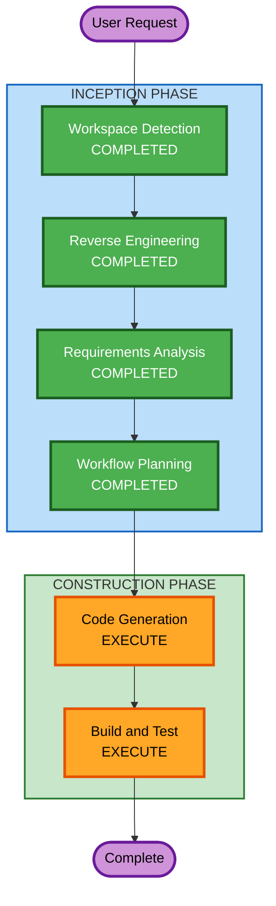

# Execution Plan

## Detailed Analysis Summary

### Transformation Scope
- **Transformation Type**: Framework Migration + Simplification
- **Primary Changes**: 
  - 移除leptonai框架，迁移到FastAPI
  - 简化搜索后端（只保留Serper）
  - 品牌重命名为"Evidence Search"
- **Related Components**: Backend (Python), Frontend (品牌文字)

### Change Impact Assessment
- **User-facing changes**: Yes - 品牌名称变更
- **Structural changes**: Yes - 后端框架从Photon迁移到FastAPI
- **Data model changes**: No - 保持原有数据结构
- **API changes**: No - 保持POST /query接口不变
- **NFR impact**: Yes - Docker容器化部署

### Risk Assessment
- **Risk Level**: Medium
- **Rollback Complexity**: Easy（可回退到原代码）
- **Testing Complexity**: Simple（功能不变，只是框架迁移）

## Workflow Visualization

## Phases to Execute

### INCEPTION PHASE
- [x] Workspace Detection - COMPLETED
- [x] Reverse Engineering - COMPLETED
- [x] Requirements Analysis - COMPLETED
- [x] User Stories - SKIP
  - **Rationale**: 技术迁移项目，无新用户功能
- [x] Workflow Planning - COMPLETED
- [x] Application Design - SKIP
  - **Rationale**: 保持原有组件结构，只替换框架
- [x] Units Generation - SKIP
  - **Rationale**: 单一工作单元，无需分解

### CONSTRUCTION PHASE
- [ ] Functional Design - SKIP
  - **Rationale**: 业务逻辑不变
- [ ] NFR Requirements - SKIP
  - **Rationale**: NFR需求已在requirements.md中明确（Docker部署）
- [ ] NFR Design - SKIP
  - **Rationale**: 无复杂NFR模式需要设计
- [ ] Infrastructure Design - SKIP
  - **Rationale**: Docker配置将在Code Generation中直接创建
- [ ] Code Generation - EXECUTE
  - **Rationale**: 核心实现阶段
- [ ] Build and Test - EXECUTE
  - **Rationale**: 验证迁移成功

## Code Generation Scope

### 后端改造 (search_with_lepton.py → app.py)
1. 移除所有leptonai imports
2. 创建FastAPI应用替代Photon类
3. 只保留search_with_serper函数
4. 使用标准OpenAI客户端
5. 移除KV缓存逻辑
6. 添加FastAPI静态文件服务

### 前端改造 (web/)
1. 替换"Lepton AI"为"Evidence Search"
2. 更新搜索框placeholder

### 新增文件
1. requirements.txt - Python依赖
2. Dockerfile - 容器构建
3. docker-compose.yml - 容器编排

## Success Criteria
- **Primary Goal**: 项目可本地独立运行，不依赖leptonai
- **Key Deliverables**: 
  - 重构后的后端代码
  - 更新后的前端代码
  - Docker部署配置
- **Quality Gates**: 
  - 搜索功能正常工作
  - LLM回答正常生成
  - Docker容器可正常启动
  - API错误响应格式保持兼容
